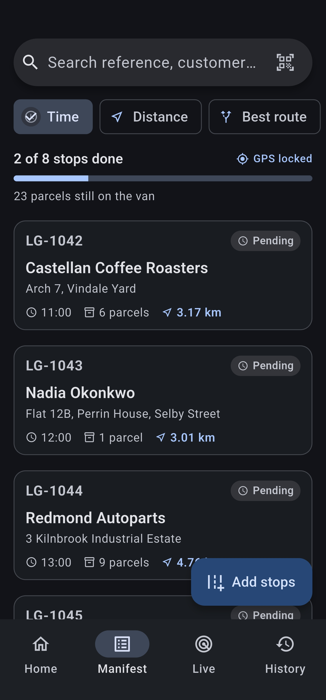
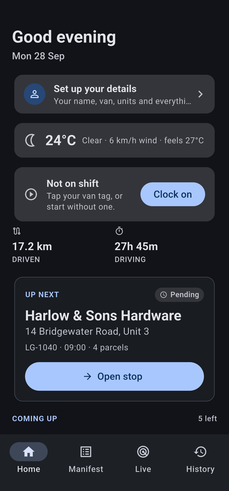
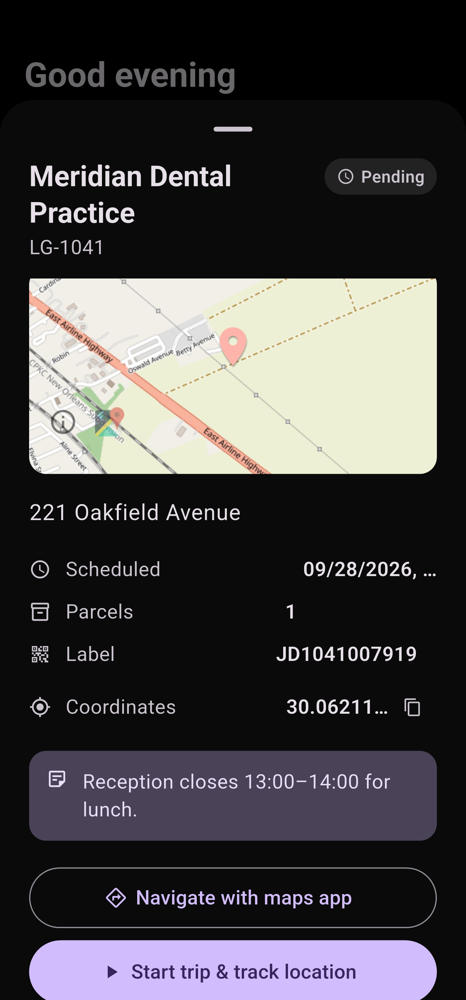
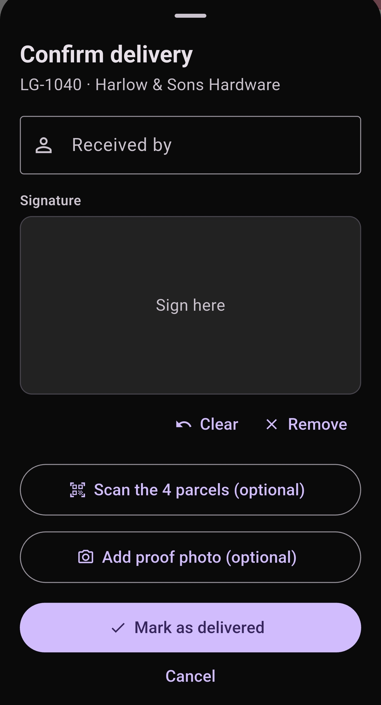
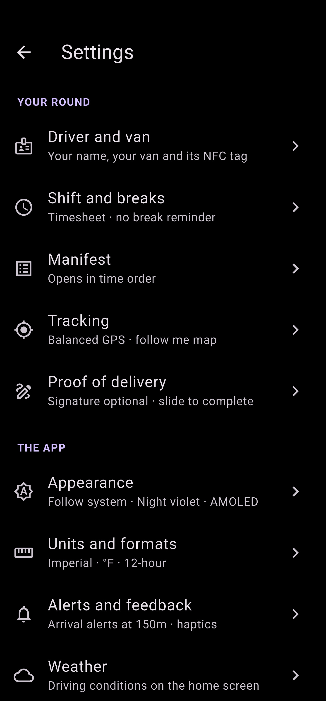

# Milepost — Offline-First Driver & Route Tracking App

A high-reliability, offline-first Flutter delivery application that records routes, manages manifests, and captures proof of delivery with background GPS tracking.

> **Prerelease:** Demo build featuring SQLite local persistence, background location tracking, and simulated dispatch manifest generation.

---

## At a Glance (For Non-Developers)

**Milepost** is a practical utility application built for delivery drivers operating on daily delivery rounds.

* **Turn-by-Turn Route Tracking:** Automatically records driving routes, total mileage, and time spent per delivery stop in the background—even with the screen turned off.
* **Smart Daily Manifest:** View and sort the day's delivery stops by time slot or proximity, complete with live arrival alerts when approaching a drop-off radius.
* **Proof of Delivery (PoD):** Close out deliveries by collecting recipient names and capturing delivery photos stored directly on the device.
* **100% Offline & Private:** Delivery stops, photos, and location history are stored entirely in a local SQLite database. No external tracking server or backend is required.

---

## Screenshots

| Home & Weather | Daily Manifest | Live Route Tracking |
|:---:|:---:|:---:|
|  |  |  |
| <sub>Daily progress & weather alerts</sub> | <sub>Distance-sorted stops & counts</sub> | <sub>Breadcrumb trail & live metrics</sub> |

| Proof of Delivery | Arrival Notification | AMOLED Black Theme |
|:---:|:---:|:---:|
|  |  |  |
| <sub>Photo capture & recipient signature</sub> | <sub>Radius alerts & background service</sub> | <sub>True-black UI & GPS accuracy controls</sub> |

---

## Key Features

| Feature | Details |
| --- | --- |
| **Home Dashboard** | Daily overview featuring a progress ring, total distance driven, upcoming stops, and real-time weather warnings (ice, fog, wind). |
| **Manifest** | Interactive delivery schedule sortable by time slot or distance, complete with live GPS status indicators and parcel counts. |
| **Live Route Tracking** | OpenStreetMap integration displaying breadcrumb trails, destination pins, real-time speed, elapsed time, and GPS fix accuracy. |
| **Proof of Delivery** | Capture recipient signatures/names and photos (persisted into dedicated local app storage to survive cache purges). |
| **Failed Stop Handling** | Log failed delivery attempts selecting from preset reason lists or custom notes. |
| **Arrival Alerts** | Automatic local notifications triggered when driving within a configurable radius of the next destination. |
| **Trip History** | Review past closed stops, distance logs, time breakdowns, and daily cumulative totals. |
| **Settings & Control** | Configurable AMOLED dark mode, unit toggles (miles/km), GPS accuracy presets, screen-on toggles, and data controls. |

---

## Tech Stack & Architecture

- **Framework:** Flutter / Dart
- **Database:** SQLite via `sqflite` for completely offline local storage
- **Mapping:** OpenStreetMap tiles paired with `geolocator` for background GPS route tracking
- **Background Operations:** Android `FOREGROUND_SERVICE` for uninterrupted route logging
- **State Management & Architecture:** `ChangeNotifier` controllers separated behind clean interface boundaries (`DeliveryRepository` and `LocationService`)
- **Testing:** 90+ automated tests covering SQLite operations, fake GPS controller mocks, odometer filtering, and weather API edge cases

### Project Structure

```text
lib/
├── models/        # Delivery, Trip, and TripPoint data structures
├── data/          # DeliveryRepository interface and SQLite implementation
├── services/      # LocationService, NotificationService, WeatherService, AppHaptics
├── state/         # DeliveryController and TrackingController (ChangeNotifier)
└── ui/            # Screens, shared widgets, and visual formatters
